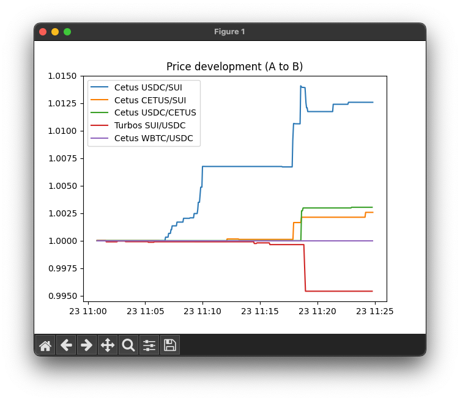
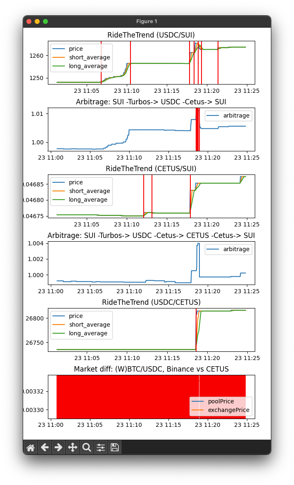

# sharkythebot-monitor

## Overview
The SharkytheSUIBot Monitor is a collection of Python scripts to monitor the status of a running instance of a
[Sharkythesui trading bot](https://github.com/CryptoInnovators/sharkythesuibot.

It produces plots of the price development and key status indicators used by sharkythebot. The plots are updated live.

## Installation and Running
First download and install the sharkythebot trading bot as instructed in the [Sharkythesuibot repository](https://github.com/CryptoInnovators/sharkythesuibot.
Run the sharkythebot and store the output to a file
```
npm run start > sharkythebot.log
```
Now, first clone this repo. Run the `pools.py` script and give the path to the log file above as an argument, e.g.
```
python3 pools.py ../sharkythebot/sharkythebot.log
```
This should show a window showing the development of the amount of coin B you will get for fixed amount coin A relative
to when the sharkythebot was started.



The `strategies.py` script is started in the same way, but produces plots of relevant variables for the trading
strategies the sharkythebot is using.

In addition to the log file, it takes in a second argument that is either `--static` or `--dynamic`, depending on
whether the plot is to be updated by `matplotlib`, or rendered statically without refreshing.
This useful for large log files that are impractical to reprocess every tick.

A red vertical line shows that the given strategy gave a trade order at this point in time.


